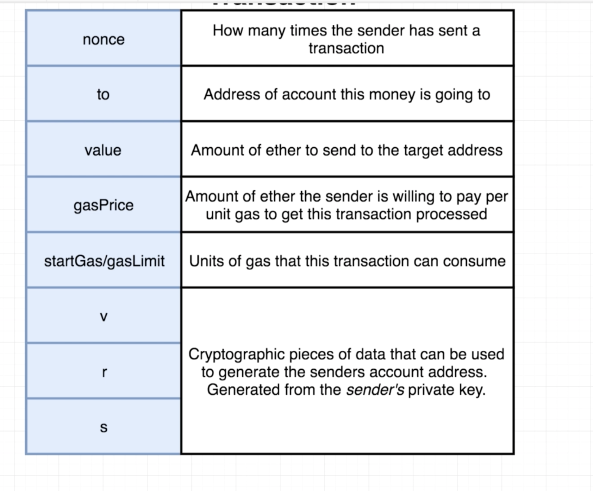
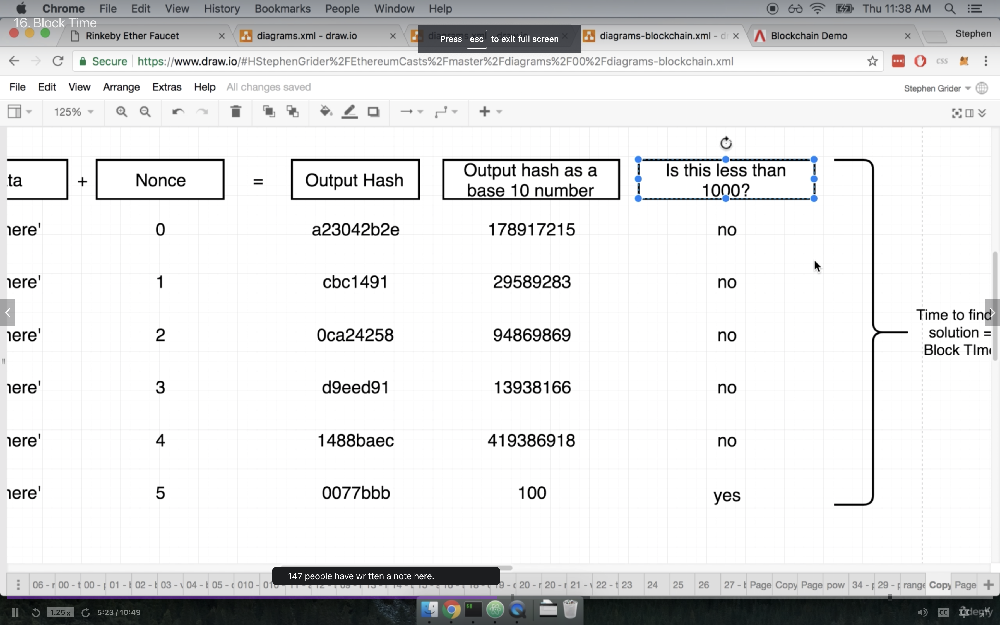
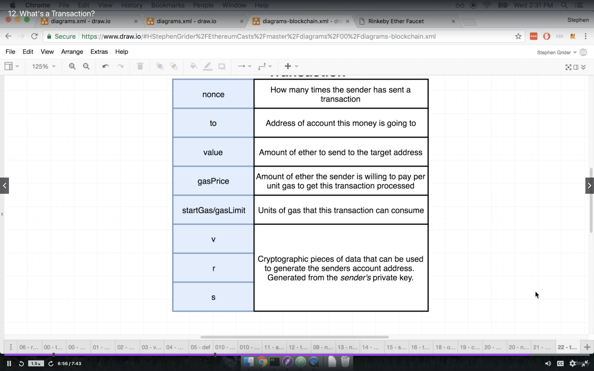

### Transcation

### BlockTime

* Rinkeby Ethereum Faucet gives 0.1 ether on rinkeby network
* https://blockchaindemo.io/
* https://etherscan.io/chart/blocktime

### ContractAccout for smartcontract similarto external network. contractAccount runs on specfic netowrk
