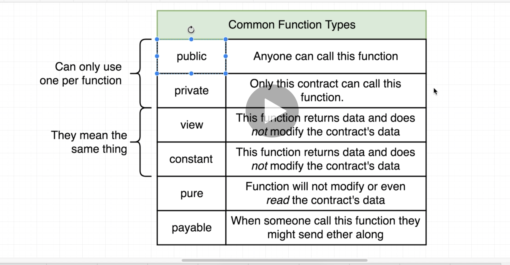
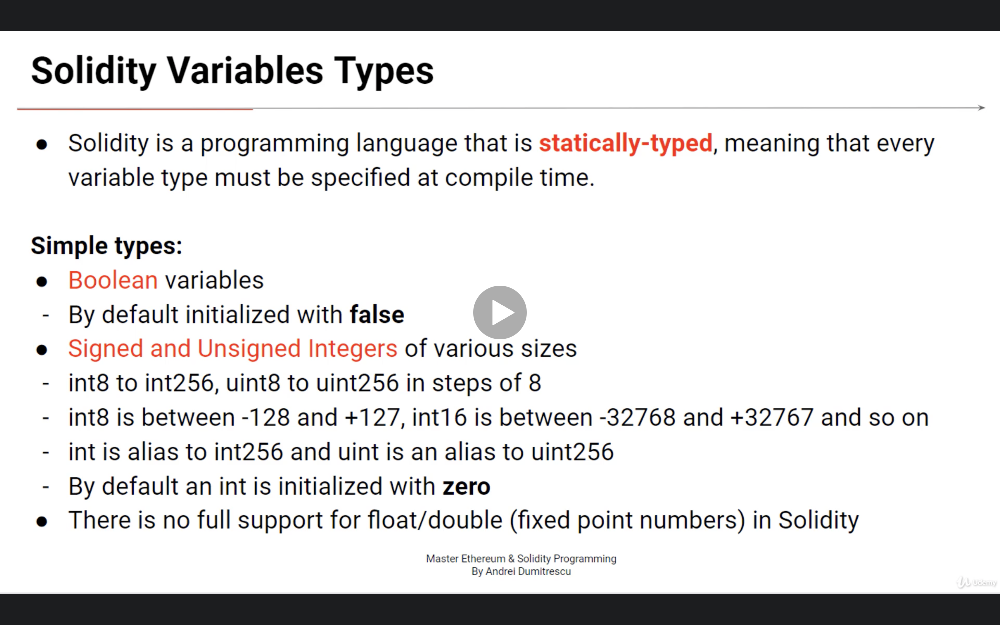
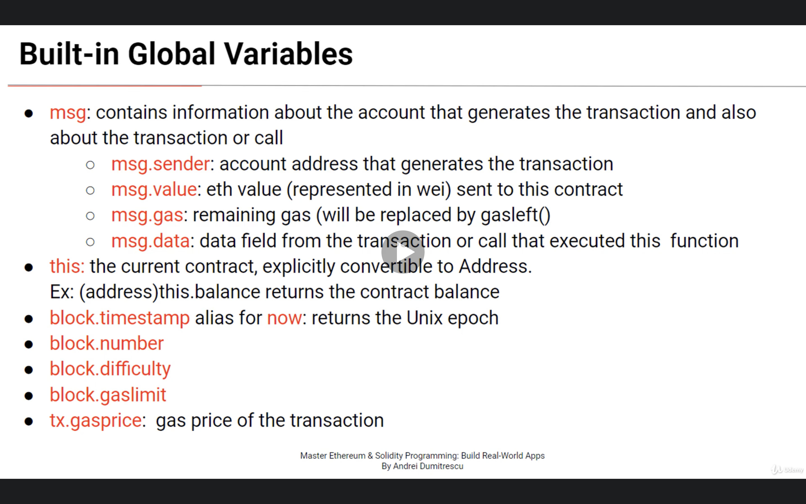
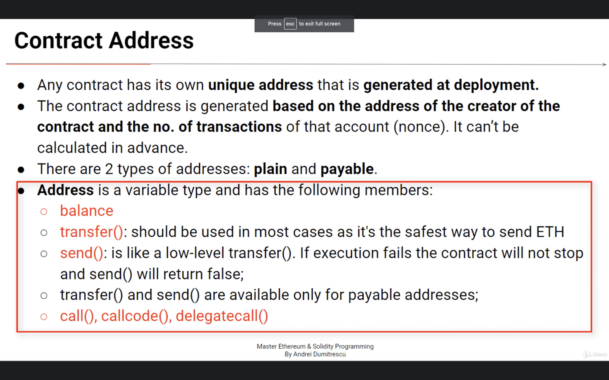

## RemixIDE

* example

```
// SPDX-License-Identifier: GPL-3.0

pragma solidity >=0.8.7 <0.9.0;

contract Property {

    int public value;

   
    function setValue(int _value) public {
        value=_value;
    }

    function retrieve() public view returns (int){
        return value;
    }
}
```


# Smart Contract Compilation
* After compiling solidity code you will receive two output `EVM bytecode` & `ABI Abstract Binary Interface`
* The contract `bytecode is public` because it can't be encrypeted as it has to run on every ethereum node
* `opcodes` or `evm operational codes`are the human redeable instructions of the program. They can be easily obtained from the byte code

## Functions types


* https://iancoleman.io/bip39/

## Where does EVM save data


### Variables & Functions
```
//SPDX-License-Identifier: GPL-3.0
 
pragma solidity >=0.5.0 <0.9.0;
 
contract Property{
    // declaring state variables saved in contract's storage
    uint price; // by default is private
    string public location;
    
    // can be initialized at declaration or in the constructor only
    address immutable public owner; 
    
    // declaring a constant
    int constant area = 100;
    
    // declaring the constructor
    // is executed only once at contract's deployment
    constructor(uint _price, string memory _location){
        price = _price;
        location = _location;
        owner = msg.sender;  // initializing owner to the account's address that deploys the contract
    }
    
    
    // getter function, returns a state variable
    // a function declared `view` does not alter the blockchain 
    function getPrice() public view returns(uint){
        return price;
    }
    
    // setter function, sets a state variable
    function setPrice(uint _price) public{
        int a; // local variable saved on stack
        a = 10;
        price = _price;
    }
    
    function setLocation(string memory _location) public{ //string types must be declared memory or storage
        location = _location;
    }
    
}

```


## Variables types


### SafeMath Overflows and Underflows
* starting with solidity 0.8 the compiler includes check arithmetics operation by default


### Fixed Arrays

```
//SPDX-License-Identifier: GPL-3.0
 
pragma solidity >=0.5.0 <0.9.0;
 
contract FixedSizeArrays{
// declaring a fixed-size array of type uint with 3 elements
uint[3] public numbers = [2, 3, 4];
 
// declaring fixed-size arrays of type bytes
bytes1 public b1;
bytes2 public b2;
bytes3 public b3;
//.. up to bytes32
 
// changing an element of the array at a specific index
function setElement(uint index, uint value) public{
numbers[index] = value;
}
 
// returning the number of elements in the array
function getLength() public view returns(uint){
return numbers.length;
}
 
// setting bytes arrays
function setBytesArray() public{
b1 = 'a'; // => 0x61 (ASCII code of `a` in hex)
b2 = 'ab'; // => 0x6162
b3 = 'z'; // => 0x7A
// b3[0] = 'a'; // ERROR => can not change individual bytes
 
// byte is an alias for bytes1 on older code
}
}
```


## Dynamic Arrays

```
//SPDX-License-Identifier: GPL-3.0
 
pragma solidity >=0.5.0 <0.9.0;
 
contract DynamicArrays{
// dynamic array of type uint
uint[] public numbers;
 
// returning length
function getLength() public view returns(uint){
return numbers.length;
}
 
// appending a new element
function addElement(uint item) public{
numbers.push(item);
}
 
// returning an element at an index
function getElement(uint i) public view returns(uint){
if(i < numbers.length){
return numbers[i];
}
return 0;
}
 
 
// removing the last element of the array
function popElement() public{
numbers.pop();
}
 
function f() public{
// declaring a memory dynamic array
// it's not possible to resize memory arrays (push() and pop() are not available).
uint[] memory y = new uint[](3);
y[0] = 10;
y[1] = 20;
y[2] = 30;
numbers = y;
}
 
}
```

### Struct & enum

```
//SPDX-License-Identifier: GPL-3.0
 
pragma solidity >=0.5.0 <0.9.0;
 
// declaring a struct type outsite of a contract
// can be used in any contract declard in this file
struct Instructor{
    uint age;
    string name;
    address addr;
}
 
contract Academy{
    // declaring a state variabla of type Instructor
    Instructor public academyInstructor;
    
    // declaring a new enum type
    enum State {Open, Closed, Unknown}
    
    // declaring and initializing a new state variable of type State
    State public academyState = State.Open;
    
    // initializing the struct in the constructor
    constructor(uint _age, string memory _name){
        academyInstructor.age = _age;
        academyInstructor.name = _name;
        academyInstructor.addr = msg.sender;
    }
    
    // changing a struct state variable
    function changeInstructor(uint _age, string memory _name, address _addr) public{
        if (academyState == State.Open){
            Instructor memory myInstructor = Instructor({
                age: _age,
                name: _name,
                addr: _addr
            }
                );
            academyInstructor = myInstructor;
        }
    }
}
 
 
// the struct can be used in any contract declared in this file
contract School{
    Instructor public schoolInstructor;
}  
```


### Maping

```
//SPDX-License-Identifier: GPL-3.0
 
pragma solidity >=0.5.0 <0.9.0;
contract Auction{
    
    // declaring a variable of type mapping
    // keys are of type address and values of type uint
    mapping(address => uint) public bids;
    
    // initializing the mapping variable
    // the key is the address of the account that calles the function
    // and the value the value of wei sent when calling the function
    function bid() payable public{
        bids[msg.sender] = msg.value;
    }
}
```

### Storage VS Memory (Solidity Gotchas)

* Note: It's mandatory for an array string or struct to specifi memory or storage
* Storage is permanent and memory is copy and not permanent

### Built in Solidity variable




### Global Variable

```
//SPDX-License-Identifier: GPL-3.0
 
pragma solidity >=0.5.0 <0.9.0;
 
contract GlobalVars{
// the current time as a timestamp (seconds from 01 Jan 1970)
uint public this_moment = block.timestamp; // `now` is deprecated and is an alias to block.timestamp)
 
// the current block number
uint public block_number = block.number;
 
// the block difficulty
uint public difficulty = block.difficulty;
 
// the block gas limit
uint public gaslimit = block.gaslimit;
 
 
address public owner;
uint public sentValue;
 
constructor(){
// msg.sender is the address that interacts with the contract (deploys it in this case)
owner = msg.sender;
}
 
 
function changeOwner() public{
// msg.sender is the address that interacts with the contract (calls the function in this case)
owner = msg.sender;
}
 
function sendEther() public payable{ // must be payable to receive ETH with the transaction
// msg.value is the value of wei sent in this transaction (when calling the function)
sentValue = msg.value;
}
 
 
// returning the balance of the contract
function getBalance() public view returns(uint){
return address(this).balance;
}
}
```


### Contract Address




### Receiving Ether

```
//SPDX-License-Identifier: GPL-3.0
 
pragma solidity >=0.6.0 <0.9.0;
 
contract Deposit{
    
    // either receive() or fallback() is mandatory for the contract to receive ETH by 
    // sending ETH to the contract's address
    
    // declaring the receive() function that is executed when sending ETH to the contract address
    // it was introduced in Solidity 0.6 and a contract can have only one receive function, 
    // declared with this syntax (without the function keyword and without arguments). 
    receive() external payable{
    }
   
 
    // declaring a fallback payable function that is called when msg.data is not empty or
    // when no other function matches
    fallback() external payable {
    }
    
    
    // ether can be send and received by the contract in the trasaction that calls this function as well
    function sendEther() public payable{
        
    }
 
   
    // returning the balance of the contract. 
    function getBalance() public view returns (uint) {
        // this is the current contract, explicitly convertible to address, 
        // and balance is a member of any variable of type address. 
        return address(this).balance;
    }
}
```


### Contract Balance
```
//SPDX-License-Identifier: GPL-3.0
 
pragma solidity >=0.5.0 <0.9.0;
 
 
 contract Deposit{
     address public owner;
     
     constructor(){
        owner = msg.sender;    
     }
     
     receive() external payable{
     }
     
     
     function getBalance() public view returns(uint){
         return address(this).balance;
     }
     
 
    // transfering ether from the contract to another address (recipient)
     function transferEther(address payable recipient, uint amount) public returns(bool){
         // checking that only contract owner can send ether from the contract to another address
         require(owner == msg.sender, "Transfer failed, you are not the owner!!");
         
         if (amount <= getBalance()){
             // transfering the amount of wei from the contract to the recipient address
             // anyone who can call this function have access to the contract's funds
             recipient.transfer(amount);
             return true;
         }else{
             return false;
         }
     }     
 }
 ```


 ### Variable Functions Visibility
 * Public, Privatte, Internal, External

```
//SPDX-License-Identifier: GPL-3.0
 
pragma solidity >=0.5.0 <0.9.0;
 
contract A{
int public x = 10;
int y = 20; // internal by default
 
// public function
function get_y() public view returns(int){
return y;
}
 
 
// private function, can be called only within this contract (not within derived contracts)
function f1() private view returns(int){
return x;
}
 
function f2() public view returns(int){
int a;
a = f1(); // can call f1
return a;
}
 
// can be called only within this contract and derived ones
function f3() internal view returns(int){
return x;
}
 
// can be called only from external contracts and application (more efficient than public)
function f4() external view returns(int){
return x;
}
 
 
function f5() public view returns(int){
int b;
// b = f4(); // ERROR => f4() is external
b = f3(); // OK => f3() is internal
b = f1(); // OK => f1() is private
return b;
}
}
 
 
// B dirives from A
contract B is A{
int public xx = f3(); // can call an internal function
// int public yy = f1(); // ERROR => f1() is private and cannot be called from derived contracts
}
 
 
contract C{
A public contract_a = new A(); // C deploys A
int public xx = contract_a.f4(); // OK => f4() is external
// int public y = contract_a.f1(); // ERROR => f1() is private
// int public yy = contract_a.f3(); // ERROR => f3() is internal
}
```†